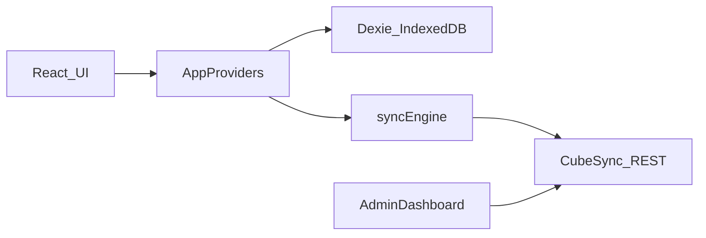

# CubeTimer development

## Architecture

CubeTimer Web is a React 19 + TypeScript SPA built with Vite. IndexedDB (Dexie) is the source of truth. CubeSync is a separate backend; this repo is the client.



- UI: `src/features/` pages for timer, stats, settings, auth, and admin
- Local data: `src/data/db.ts` plus session/solve/outbox repositories
- Sync: `src/sync/syncEngine.ts` posts mutations to `POST /v1/sync`
- Auth tokens: refresh token and user live in IndexedDB `meta`; the access token stays in memory
- Preferences and widget layouts never leave the device

## Project structure

- `src/app/` — providers, shell, home layout
- `src/api/` — HTTP client, auth, sync, admin
- `src/domain/` — models, averages, automatic sessions
- `src/features/` — route-level UI
- `src/data/` — Dexie schema and repositories
- `openapi/cubesync.yaml` — backend contract

## Local setup

Use a current Node.js LTS (the toolchain targets modern Node; `@types/node` is ^24).

```bash
cp .env.example .env
npm install
npm run dev
```

Dev server: `http://127.0.0.1:43210`. Environment: `VITE_CUBESYNC_URL` (default `http://127.0.0.1:43781`).

CubeSync must list that origin in `ALLOWED_ORIGINS` and set `CLIENT_URL` to the web origin so email links hit `/verify-email` and `/reset-password`.

## API usage

Implemented client calls:

- `/v1/auth/*` and `/v1/sync`
- `/v1/admin/stats/overview`, `/v1/admin/stats/requests`, `/v1/admin/stats/errors`

`GET /v1/me` is defined in `src/api/auth.ts` but unused; role comes from login/refresh.

Admin helpers in `src/api/admin.ts` validate `from` / `to` / `interval` (`hour` | `day`) before requesting. Feature code calls `authenticatedRequest` from `AppProviders`, which attaches a Bearer token and refreshes once on 401. Tokens are not passed into UI components.

## Admin authorization

`user.user_role === 'admin'` gates `/admin` and the Admin nav item. That is UX only. CubeSync must reject non-admin callers with 403. Promote admins on the backend; this client cannot change roles.

## Tests and quality

```bash
npm run test
npm run test:watch
npm run typecheck
npm run lint
npx playwright install chromium
npm run e2e
```

Unit tests live next to source as `*.test.ts(x)` (Vitest). Playwright specs are in `e2e/`. Admin e2e mocks `/v1/admin/stats/*`.

## Deployment

`npm run build` emits `dist/`. Serve over HTTPS. Set production `VITE_CUBESYNC_URL` at build time and keep CORS / `CLIENT_URL` aligned. Production CSP is injected in `vite.config.ts`. Authenticated `/v1/` traffic uses Workbox `NetworkOnly`.

## Troubleshooting

- **CORS / failed login:** web origin must be in CubeSync `ALLOWED_ORIGINS` (use `http://127.0.0.1:43210`, not `localhost`, unless both are allowed).
- **Verification or reset links open the wrong app:** set CubeSync `CLIENT_URL` to this web origin.
- **Sync stays local-only:** sign in and verify email.
- **Admin page is missing:** the signed-in user is not `admin`.
- **Admin metrics 403:** backend role or token is not admin; the UI cannot override that.
- **Email links 404 on a static host:** configure SPA fallback to `index.html`.
